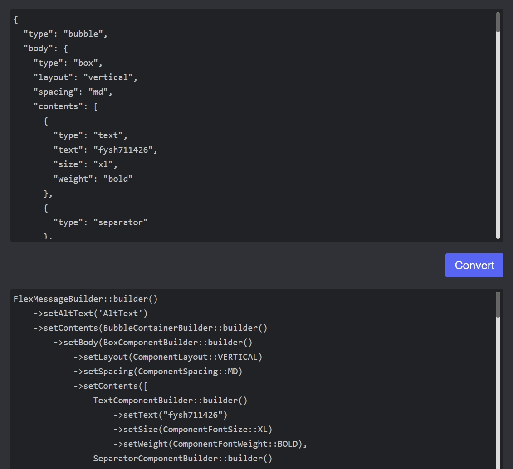

# FlexMessageConvert  

This is a FlexMessage Converter, it can convert JSON structure to C# or PHP object.  

* The SDK used by C# is [LineMessagingApi](https://github.com/pierre3/LineMessagingApi).  
* The SDK used by PHP is [line-bot-sdk-php](https://github.com/line/line-bot-sdk-php/).  

---  

### URL link  

https://fysh711426.github.io/flexMessageConvert/index.html  

---  

### Website Screen  

  

  